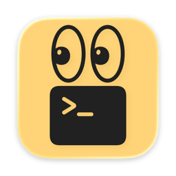
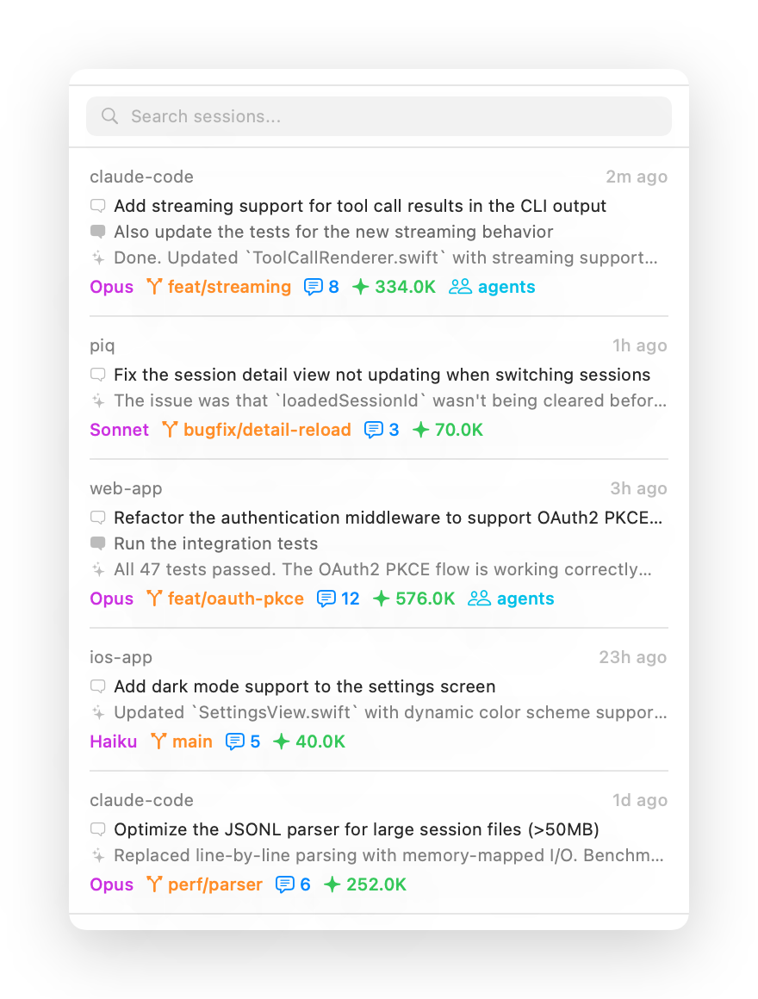
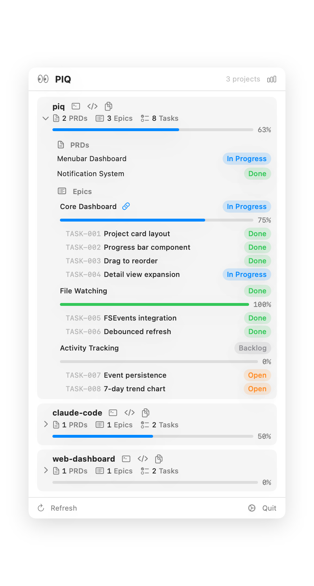
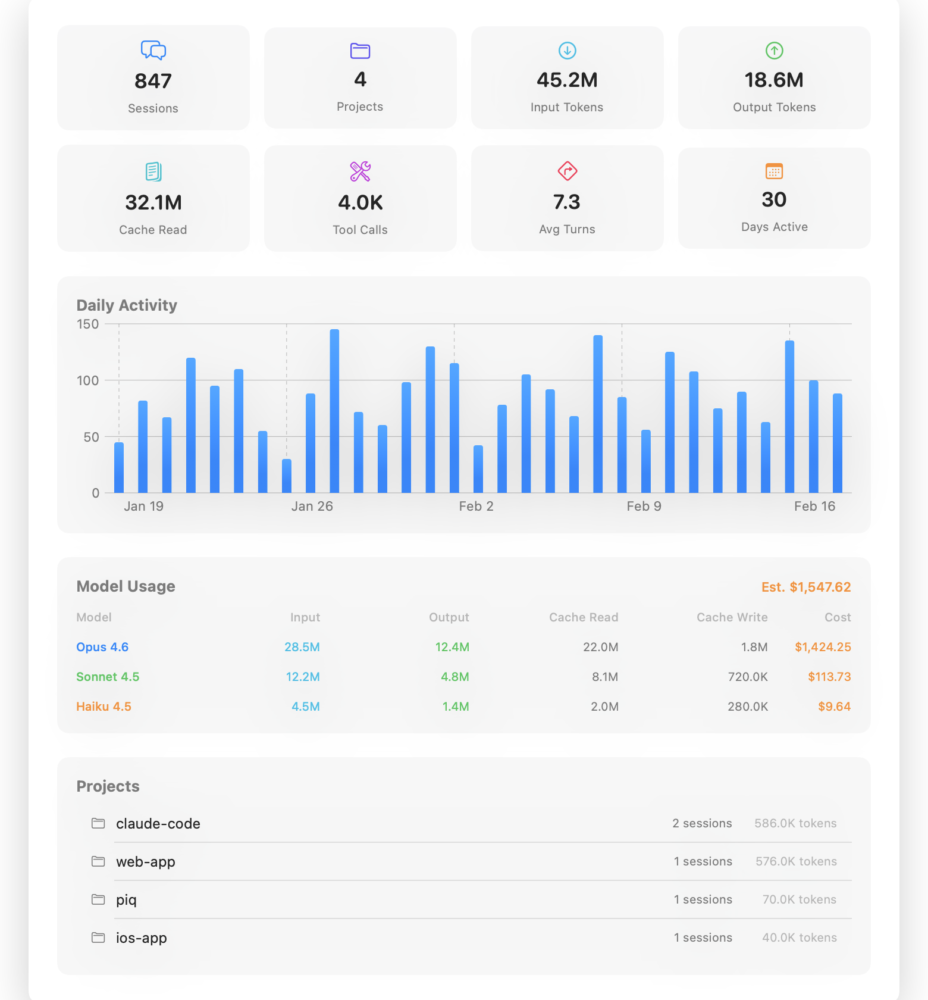

<p align="center">
  
</p>

# PIQ

macOS menubar app for browsing [Claude Code](https://docs.anthropic.com/en/docs/claude-code) sessions across all your projects.

See every conversation, tool call, and token spent — without leaving your workflow.

## Features

- **Auto-discovery** — Configure scan roots (e.g. `~/Developer`), PIQ finds all Claude Code sessions automatically
- **Real-time monitoring** — FSEvents watches for new sessions and updates, UI refreshes within seconds
- **Session browser** — Search and filter sessions by project, model, branch, or prompt content
- **Conversation detail** — Full conversation view with user prompts, assistant responses, and tool calls
- **Tool call rendering** — Specialized views for Read, Write, Edit (with LCS diff), Bash, Grep, and Glob tools
- **Markdown rendering** — Code blocks, tables, inline formatting in assistant responses
- **Statistics dashboard** — Daily activity charts, model usage breakdown, token costs, and project overview
- **API cost tracking** — Per-model cost estimates based on input/output/cache token pricing
- **Agent support** — Nested agent conversations displayed inline within Task tool calls

## Screenshots

<p align="center">
  
  
  
</p>

## Install

Download the latest DMG from [Releases](https://github.com/wuwe1/piq/releases), open it, and drag PIQ to Applications.

Signed with Developer ID and notarized by Apple — opens without Gatekeeper warnings.

### Requirements

- macOS 14.0 (Sonoma) or later

## How it works

PIQ parses Claude Code's JSONL session files from `~/.claude/projects/` directories:

```
~/.claude/projects/
└── Users-dev-my-project/
    ├── abc123.jsonl          # session file
    ├── agent-def456.jsonl    # agent sub-session
    └── ...
```

Each session file contains the full conversation history — user prompts, assistant responses, tool calls, and token usage. PIQ indexes and caches parsed sessions for fast startup.

Configure a scan root in Settings, and PIQ automatically discovers all projects with Claude Code sessions underneath.

## Build from source

```bash
git clone https://github.com/wuwe1/piq.git
cd piq
xcodebuild build -project PIQ.xcodeproj -scheme PIQ -configuration Debug
```

Run tests:

```bash
xcodebuild test -project PIQ.xcodeproj -scheme PIQ -destination 'platform=macOS'
```

## Tech stack

- Swift 6 with strict concurrency
- SwiftUI (`MenuBarExtra` with `.window` style)
- FSEvents for real-time file watching
- Custom JSONL parser with persistent index cache
- Swift Charts for statistics visualization
- LCS-based diff with character-level change highlighting

## License

MIT
